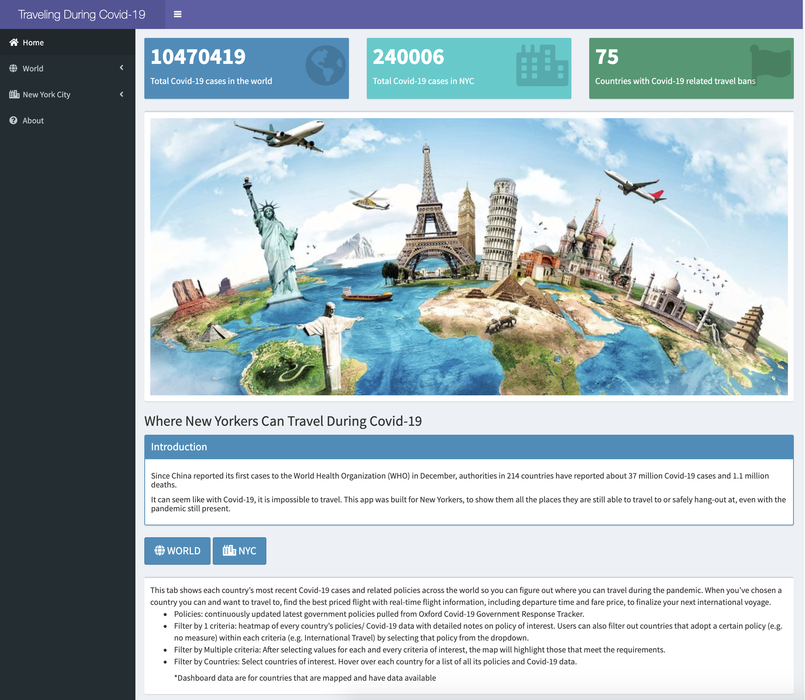

# Project 2: Shiny App Development

### [Project Description](doc/project2_desc.md)

In this second project of GR5243 Applied Data Science, we develop a *Exploratory Data Analysis and Visualization* shiny app on a topic of your choice using [JHU CSSE Covid-19 Data](https://github.com/CSSEGISandData/COVID-19) or NYC Health open data released on the [NYC Coronavirus Disease 2019 Data](https://github.com/nychealth/coronavirus-data) website. See [Project 2 Description](doc/project2_desc.md) for more details.  

The **learning goals** for this project is:

- business intelligence for data science
- study legacy codes and further development
- data cleaning
- data visualization
- systems development/design life cycle
- shiny app/shiny server

*The above general statement about project 2 can be removed once you are finished with your project. It is optional.

## Project Title: Where New Yorkers Can Travel During Covid-19
Term: Fall 2020

+ Team # 2
+ **Where New Yorkers Can Travel During Covid-19**: + Team members
	+ Kristen Akey
	+ Jaival Desai
	+ Ziyu Kong
	+ Yiran Lin
	+ Linh Nguyen

+ **Project summary**: Since China reported its first cases to the World Health Organization (WHO) in December, authorities in 214 countries have reported about 37 million Covid-19 cases and 1.1 million deaths. It can seem like with Covid-19, it is impossible to travel. This app was built for New Yorkers, to show them all the places they are still able to travel to or safely hang-out at, even with the pandemic still present.

+ **Contribution statement**:  All members brainstormed on the project topic. All team members contributed to the GitHub repository and prepared the presentation. All team members approve our work presented in our GitHub repository including this contribution statement. Detailed contribution statement [here](doc/a_note_on_contributions.md).

+ **Project link**: [https://kka2120.shinyapps.io/travel-during-covid-19/](https://kka2120.shinyapps.io/travel-during-covid-19/)




Following [suggestions](http://nicercode.github.io/blog/2013-04-05-projects/) by [RICH FITZJOHN](http://nicercode.github.io/about/#Team) (@richfitz). This folder is orgarnized as follows.

```
proj/
├── app/
├── lib/
├── data/
├── doc/
└── output/
```

Please see each subfolder for a README file.

